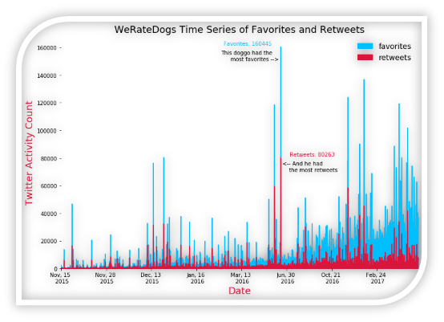

# WeRateDogs

# Finding the Winners

At number one with the highest rating is Atticus, earning a 1776 out of 10! 

At second place Snoop Dogg comes in at very impressive 420 out of 10.

# Removing the Global Outliers for Cleaner Comparison

The two winners above are data points that were accurately gathered, but their ratings are global outliers to the rest of the observations. These global outliers greatly increase the standard deviation of the field ‘rating’ in our DataFrame.
To simplify this analysis, I decided to remove the two outliers, and take a deeper look into the distribution of the ratings by dog type.

# Distribution of Dog Ratings by Dog Types

With the outliers removed you can see that the total distribution of the WeRateDogs is skew the left (since the ratings are group in descending order). 
The lower values are not nearly as common as the ratings that are either 10/10 or greater than 10/10. Ratings of 10, 11, and 12 are quite common. 
14/10 happens at a much less frequent manner. Below, I will look more into the specific rating of 14 and 13 to see which breeds were most likely to receive it.  

This plot categorizes the distributions by dog breeds, showing subtle disparities between the frequency of ratings.

At the top, Golden Retriever appears to consistently outperform the other breeds, receiving the most 14’s, 13, and 12’s. The frequency of ratings also shows that the most common dog breed detected in the data set was Golden Retriever, with a count of 138 out of the 1977. 
Another observation that can be taken away from this plot was that WeRateDogs had a consistent pattern of rating all dogs at or above 10 out of 10, regardless of breed. 
Although, they did like picking on the occasional Pug or Chihuah, who have suspiciously received a few more 7 to 3 ratings than the others.   

# Bayesian Probability of Dog Ratings for the Top 5 Dog Types

Once the data was discrete and the frequencies were gathered I could then use what I know about how WeRateDogs twitter account rates each dog breed and derive a probability table. 
Using the probability table I could then calculate the bayesian conditional probability of how likely each rating was given the dog’s breed. 

I found that if a Golden Retriever is posted on WeRateDogs it has a 1% chance of receiving a rating of 9, a 10% chance of receiving a 10, a 19% of receiving an 11, but the rating the Golden Retriever is most likely to receive is a 12 out of 10, which has a probability 64%. The likelihood of receiving a rating of 12 is more than twice as likely as the next most likely rating. 
At the highest end of the spectrum, a Golden Retriever has a 31% chance of receiving a 13 and a 4% chance of receiving a rating of 14. Next up I will take a look at the inverse conditional probabilities, the liklihood of the dog breed given that the rating is a 13 as well as the likelihood of the dog breed given the rating is a 14.

No matter how likely one of the top 5 breeds were to get a 14 or 13, it is more likely to be part of the Other breeds category, once the cumulative probabilities are all added together. The likelihood a rating of 14 or 13 was for a dog who was not part of the top 5 breeds was 74% and 64%, respectfully. 
Given that the rating was a 14, the liklihood that the dog is a Golden Retriever is 16%. The liklihood that the dog’s breed is a Pembroke is 26%, siginifcantly higher than the Golden Retriever. Even though they both had 4 ratings of 14, the Pembroke had just over half as many observations in the dataset, 88, compared to Golden Retrievers 138 count. 
Given that the rating was 13, the liklihood that a dog was a Golden Retriever was 17%, and the liklihood of the dog being a Pembroke 10%. Labradors and Chihuahs were both 5% likely. Of the top 5 breeds, it was the least likely that a rating of  13 would be a Pug, which only had 4% chance.

# Time Series Analysis of Twitter Activity

  

From 2015 to Spring of 2016, WeRateDogs had relatively modest twitter traffic.  The page did make a few jumps over the 80,000 favorite threshold in December of 2015, but it took until the end of 2016 for the account to consistently hit their over 100,000 favorite count per tweet that they are now accustom to. 
This doggo above is named Cody (Cody is his real name if you watch his now famous video).  Cody learned how to stand in the pool and earned himself the most favorites & retweets of all the dogs on WeRateDogs within this dataset. Cody’s tweet really took off when it was tweeted out on June 18th of 2016, long before it was common for WeRateDogs tweets to receive this level of activity, receiving 80, 263 retweets and 160,445 favorites. Good boy, Cody. 

